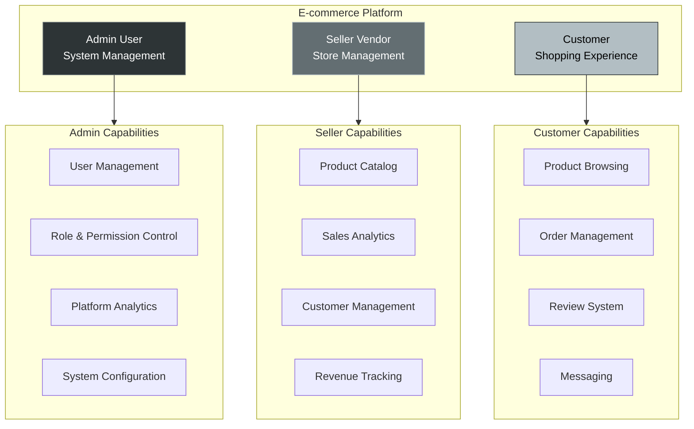
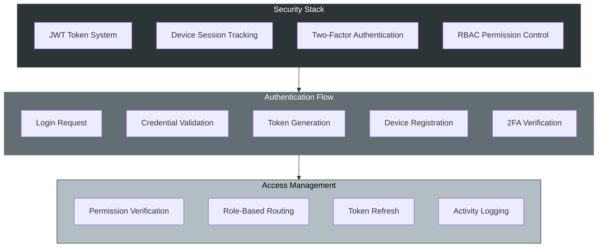

# Multi-Vendor System Architecture

### System Overview

A scalable multi-vendor e-commerce backend built with **Nest.js** framework, designed to support complex business operations with robust security and modular architecture.
The system serves three distinct user roles with comprehensive feature sets for real-world e-commerce operations.

> **Status:** This repository is actively under development. Some sections are temporarily commented out while implementation is in progress.

### Principal Sponsors

<table cellpadding="8" cellspacing="0" style="border:1px solid #e6edf3;border-radius:10px;padding:12px;">
  <tr>
    <td align="center" style="vertical-align:middle;">
      
    </td>
    <td align="center" style="vertical-align:middle;">
      
    </td>
    <td align="center" style="vertical-align:middle;">
      
    </td>
    <td align="center" style="vertical-align:middle;">
      
    </td>
    <td align="center" style="vertical-align:middle;">
      
    </td>
    <td align="center" style="vertical-align:middle;">
      
    </td>
    <td align="center" style="vertical-align:middle;">
      
    </td>
    <td align="center" style="vertical-align:middle;">
      <a href="https://docs.bullmq.io" target="_blank" rel="noopener noreferrer">
        <!-- upload assets/logos/bullmq.svg then this jsDelivr link will work -->
        
      </a>
    </td>
    <td align="center" style="vertical-align:middle;">
      <a href="https://sepay.vn" target="_blank" rel="noopener noreferrer">
        <!-- upload assets/logos/sepay.svg then this jsDelivr link will work -->
        
      </a>
    </td>
  </tr>
</table>

---

### Role-Based System Architecture

#### Core User Roles & Capabilities

---

### Security & Authentication Architecture

#### Multi-Layer Security Implementation

#### Key Security Features

- **Token-based Authentication**: Access & Refresh token system with configurable expiration
- **Device Management**: Track and manage active sessions across multiple devices
- **2FA Support**: TOTP-based two-factor authentication for enhanced security
- **Role-Based Access Control**: Granular permissions for different user types
- **Session Security**: Automatic device fingerprinting and suspicious activity detection

---

### Product Management System

#### Multi-Vendor Catalog Architecture

> **Note:** This feature is currently under development.

---

### Order & Payment Processing

> **Note:** This feature is currently under development.

---

### Notification & Messaging System

> **Note:** This feature is currently under development.

---

### Database Architecture

#### Key Components

- **User Management**: Multi-role user system with authentication tracking
- **Product Catalog**: Vendor-based product structure with variants and stock
- **Order Processing**: Full lifecycle management with payment integration
- **Multi-language Support**: Translation system for localization
- - **Analytics & Reporting**: Data tracking for business intelligence

> **Detailed DB docs:** For the full, interactive database schema, table descriptions, and ER diagrams, please refer to the project DB documentation hosted on dbdocs: https://dbdocs.io/vodinhquan2707.it/multi-vendor

---
