# Multi-Vendor System Architecture

### System Overview

A scalable multi-vendor e-commerce backend built with **Nest.js** framework, designed to support complex business operations with robust security and modular architecture.
The system serves three distinct user roles with comprehensive feature sets for real-world e-commerce operations.

> **Status:** This repository is actively under development. Some sections are temporarily commented out while implementation is in progress.

### Principal Sponsors

---

### Role-Based System Architecture

```mermaid
---
config:
  layout: elk
---
flowchart TB
 subgraph Security["🛡️ Security Layer"]
        AuthGuard["Authentication Guard"]
        AuthZGuard["Authorization Guard"]
        RateLimit["Rate Limiting"]
  end
 subgraph Controllers["🎯 Controllers Layer"]
        AuthCtrl["🔐 Auth Controller"]
        UserCtrl["👤 User Controller"]
        ProfileCtrl["📋 Profile Controller"]
        ProductCtrl["📦 Product Controller"]
        OrderCtrl["🛒 Order Controller"]
        PaymentCtrl["💳 Payment Controller"]
        MediaCtrl["📁 Media Controller"]
  end
 subgraph Services["💼 Services Layer"]
        AuthSvc["Auth Service"]
        UserSvc["User Service"]
        ProfileSvc["Profile Service"]
        ProductSvc["Product Service"]
        OrderSvc["Order Service"]
        PaymentSvc["Payment Service"]
        MediaSvc["Media Service"]
  end
 subgraph DataAccess["🗄️ Data Access Layer"]
        AuthRepo["Auth Repository"]
        UserRepo["User Repository"]
        ProfileRepo["Profile Repository"]
        ProductRepo["Product Repository"]
        OrderRepo["Order Repository"]
        PaymentRepo["Payment Repository"]
        MediaRepo["Media Repository"]
  end
 subgraph Infrastructure["🔧 Infrastructure"]
        Prisma["Prisma ORM"]
        TokenSvc["Token Service"]
        HashSvc["Hashing Service"]
        EmailSvc["Email Service"]
        CacheSvc["Cache Service"]
        FileSvc["File Service"]
  end
 subgraph Storage["💾 Storage Layer"]
        PostgreSQL["🗄️ PostgreSQL"]
        Redis["🔴 Redis"]
        S3["☁️ S3 Storage"]
  end
 subgraph External["🌐 External Services"]
        EmailProvider["📧 Email Provider"]
        PaymentProvider["💳 Payment Gateway"]
  end
    NextJS["🌐 Next.js Frontend<br>SSR/CSR"] -- HTTPS REST/GraphQL --> Gateway["🚪 API Gateway"]
    Gateway -- Request Interception --> Security
    Security -- JWT Validation --> AuthCtrl
    Security -- Role/Permission Check --> UserCtrl
    Security -- Rate Limit Check --> ProfileCtrl
    AuthCtrl -- Authentication Flow --> AuthSvc
    UserCtrl -- User Management --> UserSvc
    ProfileCtrl -- Profile Operations --> ProfileSvc
    ProductCtrl -- Product Catalog --> ProductSvc
    OrderCtrl -- Order Processing --> OrderSvc
    PaymentCtrl -- Payment Processing --> PaymentSvc
    MediaCtrl -- File Operations --> MediaSvc
    AuthSvc -- Auth Data --> AuthRepo
    UserSvc -- User Data --> UserRepo
    ProfileSvc -- Profile Data --> ProfileRepo
    ProductSvc -- Product Data --> ProductRepo
    OrderSvc -- Order Data --> OrderRepo
    PaymentSvc -- Payment Data --> PaymentRepo
    MediaSvc -- Media Data --> MediaRepo
    AuthRepo -- ORM Queries --> Prisma
    UserRepo -- ORM Queries --> Prisma
    ProfileRepo -- ORM Queries --> Prisma
    ProductRepo -- ORM Queries --> Prisma
    OrderRepo -- ORM Queries --> Prisma
    PaymentRepo -- ORM Queries --> Prisma
    MediaRepo -- ORM Queries --> Prisma
    Prisma -- SQL Queries --> PostgreSQL
    CacheSvc -- Cache Operations --> Redis
    FileSvc -- File Storage --> S3
    EmailSvc -- Send Emails --> EmailProvider
    PaymentSvc -- Process Payments --> PaymentProvider
    AuthSvc -- Hash/Verify --> HashSvc
    UserSvc -- Hash Passwords --> HashSvc
    AuthSvc -- Generate Tokens --> TokenSvc
    AuthSvc -- Send OTP Emails --> EmailSvc
    UserSvc -- Send Notifications --> EmailSvc
    MediaSvc -- File Operations --> FileSvc
    AuthGuard -- Token Validation --> TokenSvc
    AuthZGuard -- Permission Checks --> Prisma
    RateLimit -- Request Tracking --> CacheSvc
    UserRepo -. Security: Exclude sensitive fields .-> UserCtrl
    AuthRepo -. Security: Data filtering .-> AuthCtrl
     NextJS:::clientBox
     Gateway:::gatewayBox
     AuthGuard:::guardBox
     AuthZGuard:::guardBox
     RateLimit:::guardBox
     AuthCtrl:::controllerBox
     UserCtrl:::controllerBox
     ProfileCtrl:::controllerBox
     ProductCtrl:::controllerBox
     OrderCtrl:::controllerBox
     PaymentCtrl:::controllerBox
     MediaCtrl:::controllerBox
     AuthSvc:::serviceBox
     UserSvc:::serviceBox
     ProfileSvc:::serviceBox
     ProductSvc:::serviceBox
     OrderSvc:::serviceBox
     PaymentSvc:::serviceBox
     MediaSvc:::serviceBox
     AuthRepo:::repoBox
     UserRepo:::repoBox
     ProfileRepo:::repoBox
     ProductRepo:::repoBox
     OrderRepo:::repoBox
     PaymentRepo:::repoBox
     MediaRepo:::repoBox
     Prisma:::infraBox
     TokenSvc:::infraBox
     HashSvc:::infraBox
     EmailSvc:::infraBox
     CacheSvc:::infraBox
     FileSvc:::infraBox
     PostgreSQL:::dbBox
     Redis:::cacheBox
     S3:::storageBox
     EmailProvider:::externalBox
     PaymentProvider:::externalBox


```

#### Core User Roles & Capabilities

---

### Security & Authentication Architecture

#### Multi-Layer Security Implementation

#### Key Security Features

- **Token-based Authentication**: Access & Refresh token system with configurable expiration
- **Device Management**: Track and manage active sessions across multiple devices
- **2FA Support**: TOTP-based two-factor authentication for enhanced security
- **Role-Based Access Control**: Granular permissions for different user types
- **Session Security**: Automatic device fingerprinting and suspicious activity detection

---

### Product Management System

#### Multi-Vendor Catalog Architecture

> **Note:** This feature is currently under development.

---

### Order & Payment Processing

> **Note:** This feature is currently under development.

---

### Notification & Messaging System

> **Note:** This feature is currently under development.

---

### Database Architecture

#### Key Components

- **User Management**: Multi-role user system with authentication tracking
- **Product Catalog**: Vendor-based product structure with variants and stock
- **Order Processing**: Full lifecycle management with payment integration
- **Multi-language Support**: Translation system for localization
- - **Analytics & Reporting**: Data tracking for business intelligence

> **Detailed DB docs:** For the full, interactive database schema, table descriptions, and ER diagrams, please refer to the project DB documentation hosted on dbdocs: https://dbdocs.io/vodinhquan2707.it/multi-vendor

---
