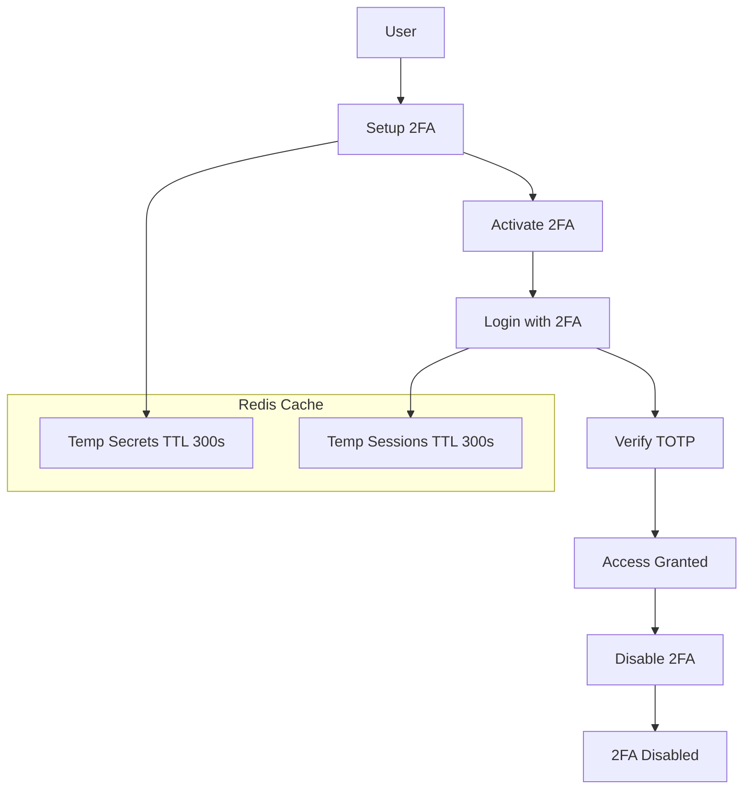
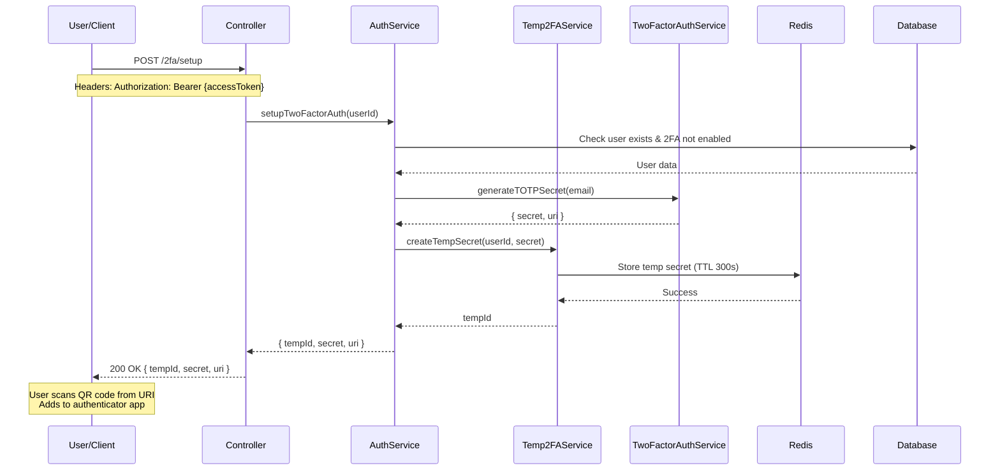
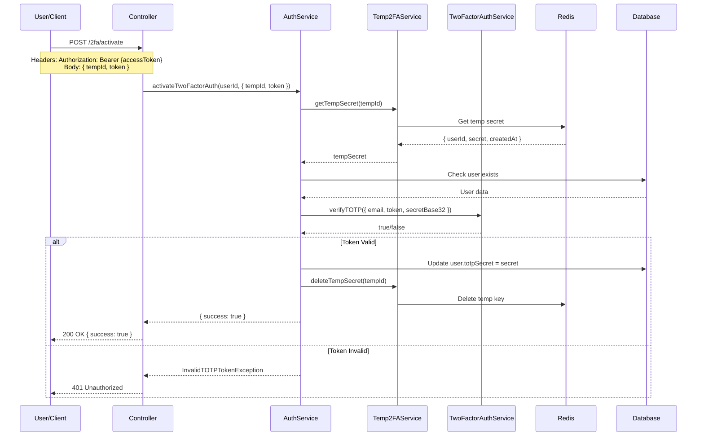
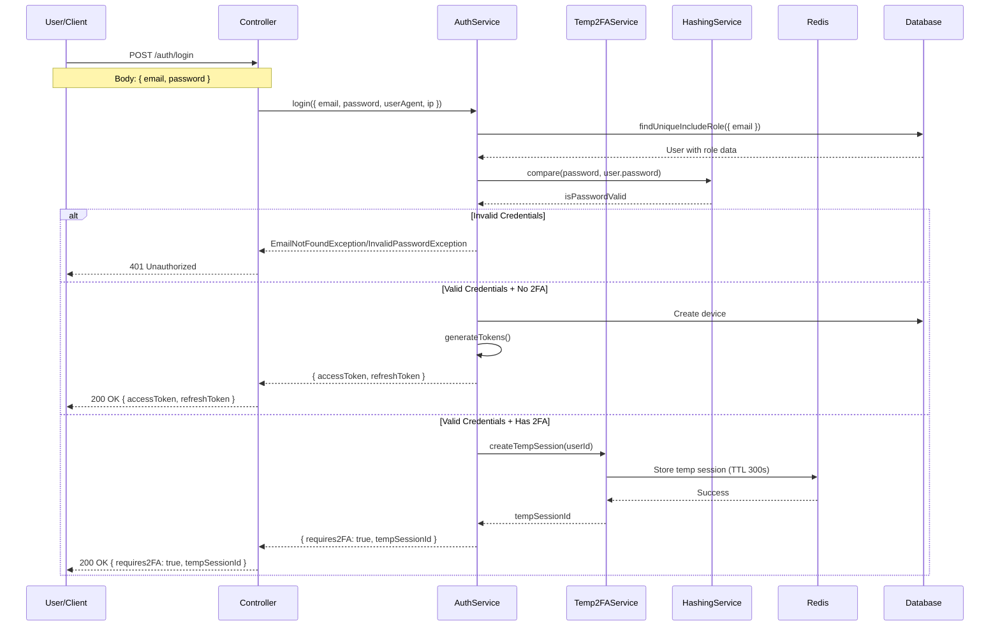
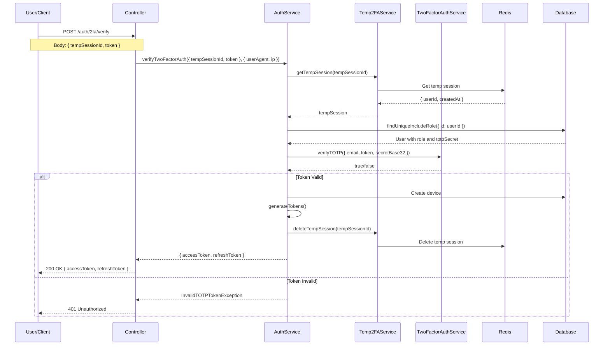
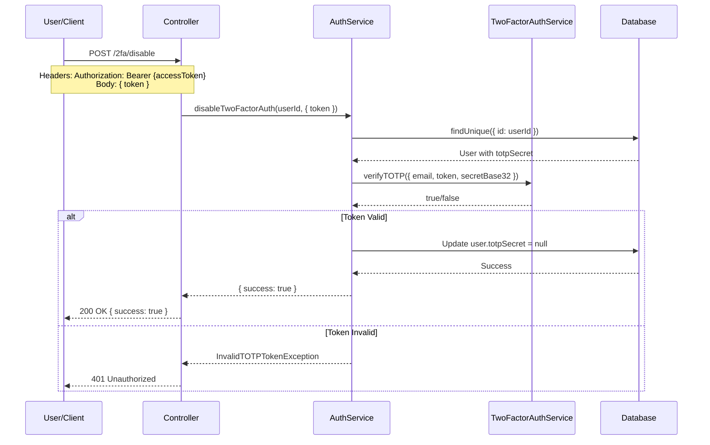
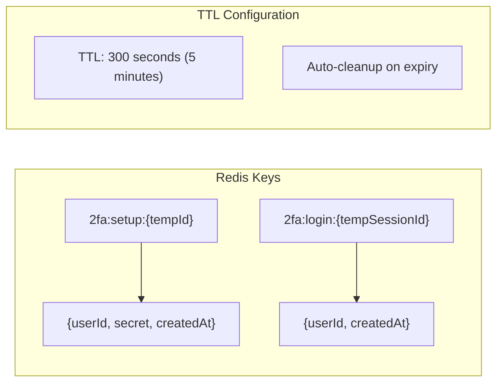
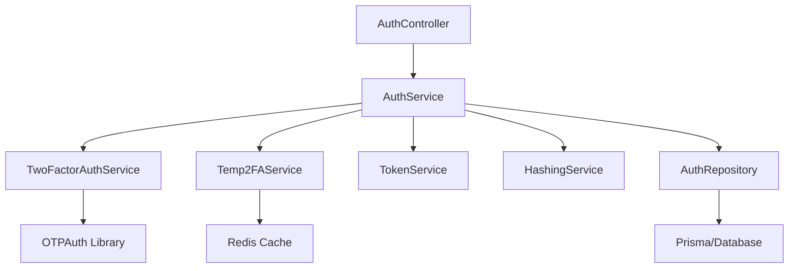
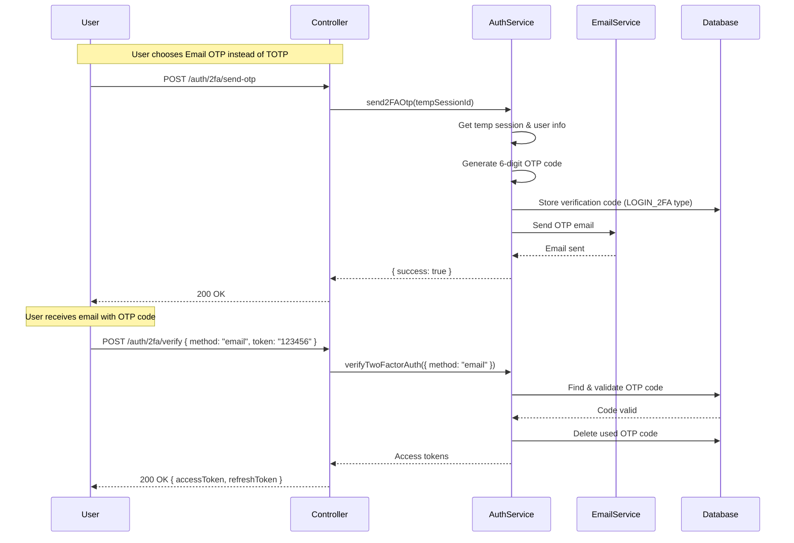

# Two-Factor Authentication (2FA) Flow Documentation

## 📋 Tổng quan

Tính năng Two-Factor Authentication (2FA) hỗ trợ hai phương thức xác thực:

- **TOTP (Time-based One-Time Password)**: Sử dụng authenticator app như Google Authenticator
- **Email OTP**: Gửi mã xác thực qua email

Flow được thiết kế theo mô hình two-step login với temporary storage sử dụng Redis cache.

## 🔄 Flow Overview



## 🚀 Chi tiết Flow

### 1. Setup 2FA Flow



#### Request/Response Details:

**Request:**

```http
POST /2fa/setup
Authorization: Bearer {accessToken}
Content-Type: application/json

{}
```

**Response:**

```json
{
  "tempId": "550e8400-e29b-41d4-a716-446655440000",
  "secret": "JBSWY3DPEHPK3PXP",
  "uri": "otpauth://totp/Multi%20Vendor%20E-commerce:user@example.com?issuer=Multi%20Vendor%20E-commerce&secret=JBSWY3DPEHPK3PXP&algorithm=SHA1&digits=6&period=30"
}
```

---

### 2. Activate 2FA Flow



#### Request/Response Details:

**Request:**

```http
POST /2fa/activate
Authorization: Bearer {accessToken}
Content-Type: application/json

{
  "tempId": "550e8400-e29b-41d4-a716-446655440000",
  "token": "123456"
}
```

**Response:**

```json
{
  "success": true
}
```

---

### 3. Two-Step Login Flow



#### Request/Response Details:

**Request:**

```http
POST /auth/login
Content-Type: application/json

{
  "email": "user@example.com",
  "password": "userpassword123"
}
```

**Response (No 2FA):**

```json
{
  "accessToken": "eyJhbGciOiJIUzI1NiIsInR5cCI6IkpXVCJ9...",
  "refreshToken": "eyJhbGciOiJIUzI1NiIsInR5cCI6IkpXVCJ9..."
}
```

**Response (Has 2FA):**

```json
{
  "requires2FA": true,
  "tempSessionId": "750e8400-e29b-41d4-a716-446655440001"
}
```

---

### 4. 2FA Verification Flow



#### Request/Response Details:

**Request:**

```http
POST /auth/2fa/verify
Content-Type: application/json

{
  "tempSessionId": "750e8400-e29b-41d4-a716-446655440001",
  "token": "654321"
}
```

**Response:**

```json
{
  "accessToken": "eyJhbGciOiJIUzI1NiIsInR5cCI6IkpXVCJ9...",
  "refreshToken": "eyJhbGciOiJIUzI1NiIsInR5cCI6IkpXVCJ9..."
}
```

---

### 5. Disable 2FA Flow



#### Request/Response Details:

**Request:**

```http
POST /2fa/disable
Authorization: Bearer {accessToken}
Content-Type: application/json

{
  "token": "789012"
}
```

**Response:**

```json
{
  "success": true
}
```

---

## 🔧 Technical Implementation Details

### Redis Cache Structure



### Service Dependencies



### Error Handling

| Error                         | HTTP Status | Message Key                | Trigger Condition                |
| ----------------------------- | ----------- | -------------------------- | -------------------------------- |
| `TOTPAlreadyEnabledException` | 422         | `Error.TOTPAlreadyEnabled` | Setup 2FA when already enabled   |
| `InvalidTempIdException`      | 422         | `Error.InvalidTempId`      | Invalid or expired tempId        |
| `InvalidTOTPTokenException`   | 422         | `Error.InvalidTOTPToken`   | Wrong TOTP code                  |
| `InvalidTempSessionException` | 422         | `Error.InvalidTempSession` | Invalid or expired tempSessionId |
| `TOTPNotEnabledException`     | 422         | `Error.TOTPNotEnabled`     | Disable 2FA when not enabled     |

---

## 🔒 Security Considerations

### 1. Secret Management

- **Secret Generation**: 20-byte random secret using `OTPAuth.Secret`
- **Storage**: Base32 encoded in database (TODO: encrypt)
- **Transmission**: Secret only returned once during setup
- **Logging**: Never log secrets, URIs, or sensitive data

### 2. Temporary Storage

- **TTL**: 5 minutes for both temp secrets and sessions
- **Isolation**: Each user gets unique UUIDs
- **Cleanup**: Automatic Redis expiry + manual deletion on success

### 3. TOTP Validation

- **Window**: ±1 time step (30 seconds) for clock skew tolerance
- **Algorithm**: SHA1, 6 digits, 30-second period
- **Replay Protection**: None implemented (within scope limitations)

### 4. Rate Limiting

- Not implemented in current scope
- Recommended: Add rate limiting for verification endpoints

---

## 📱 Client Integration Guide

### 1. Setup Flow

```javascript
// Step 1: Setup 2FA
const setupResponse = await fetch('/2fa/setup', {
  method: 'POST',
  headers: { Authorization: `Bearer ${accessToken}` },
})
const { tempId, secret, uri } = await setupResponse.json()

// Step 2: Show QR code to user (using uri)
showQRCode(uri)

// Step 3: User enters TOTP code from authenticator
const activateResponse = await fetch('/2fa/activate', {
  method: 'POST',
  headers: { Authorization: `Bearer ${accessToken}` },
  body: JSON.stringify({ tempId, token: userEnteredCode }),
})
```

### 2. Login Flow

```javascript
// Step 1: Initial login
const loginResponse = await fetch('/auth/login', {
  method: 'POST',
  body: JSON.stringify({ email, password }),
})
const loginData = await loginResponse.json()

if (loginData.requires2FA) {
  // Step 2: Prompt for TOTP code
  const totpCode = await promptUserForTOTP()

  // Step 3: Verify 2FA
  const verifyResponse = await fetch('/auth/2fa/verify', {
    method: 'POST',
    body: JSON.stringify({
      tempSessionId: loginData.tempSessionId,
      token: totpCode,
    }),
  })
  const { accessToken, refreshToken } = await verifyResponse.json()
} else {
  // No 2FA required
  const { accessToken, refreshToken } = loginData
}
```

---

## 🧪 Testing Scenarios

### Manual Testing Checklist

- [ ] **Setup 2FA**: Valid user can generate secret and QR code
- [ ] **Setup 2FA**: Already enabled user gets error
- [ ] **Activate 2FA**: Valid TOTP code activates successfully
- [ ] **Activate 2FA**: Invalid TOTP code returns 401
- [ ] **Activate 2FA**: Expired tempId returns error
- [ ] **Login No 2FA**: Returns tokens directly
- [ ] **Login With 2FA**: Returns tempSessionId
- [ ] **2FA Verify**: Valid TOTP returns tokens
- [ ] **2FA Verify**: Invalid TOTP returns 401
- [ ] **2FA Verify**: Expired tempSessionId returns error
- [ ] **Disable 2FA**: Valid TOTP disables successfully
- [ ] **Disable 2FA**: User without 2FA gets error

### Redis Verification

```bash
# Check Redis keys
redis-cli KEYS "2fa:*"

# Check TTL
redis-cli TTL "2fa:setup:{tempId}"
redis-cli TTL "2fa:login:{tempSessionId}"
```

---

## � Email OTP Verification (Enhancement)

### Overview

Ngoài TOTP, hệ thống còn hỗ trợ xác thực qua email OTP trong quá trình verification.

### New Endpoint: Send Email OTP

```http
POST /auth/2fa/send-otp
Content-Type: application/json

{
  "tempSessionId": "550e8400-e29b-41d4-a716-446655440000"
}
```

**Response:**

```json
{
  "success": true
}
```

### Enhanced Verification

Endpoint `/auth/2fa/verify` hiện hỗ trợ thêm parameter `method`:

```http
POST /auth/2fa/verify
Content-Type: application/json

{
  "tempSessionId": "550e8400-e29b-41d4-a716-446655440000",
  "token": "123456",
  "method": "email"  // or "totp" (default)
}
```

### Flow Diagram



### Database Changes

Added `LOGIN_2FA` to `VerificationCodeType` enum:

```prisma
enum VerificationCodeType {
  REGISTER
  FORGOT_PASSWORD
  LOGIN
  DISABLE_2FA
  LOGIN_2FA  // New type for 2FA email verification
}
```

---

## �📚 References

- [NestJS Caching Documentation](https://docs.nestjs.com/techniques/caching)
- [OTPAuth Library](https://github.com/hectorm/otpauth)
- [RFC 6238 - TOTP Specification](https://tools.ietf.org/html/rfc6238)
- [Google Authenticator Key URI Format](https://github.com/google/google-authenticator/wiki/Key-Uri-Format)

---

## 🔄 Future Enhancements (Out of Scope)

- Backup codes for recovery
- Trusted device management
- Replay attack protection
- Rate limiting implementation
- Audit logging
- SMS-based 2FA fallback
- Hardware token support (FIDO2/WebAuthn)
