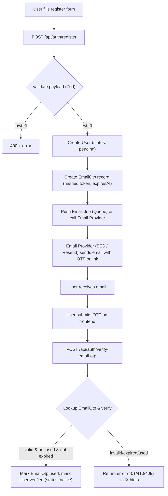
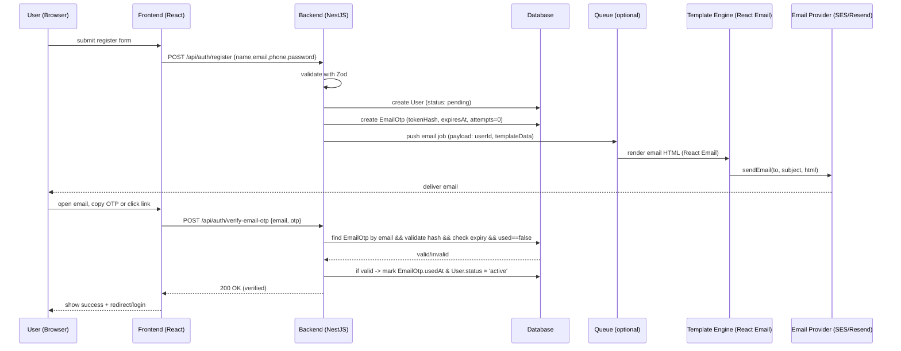
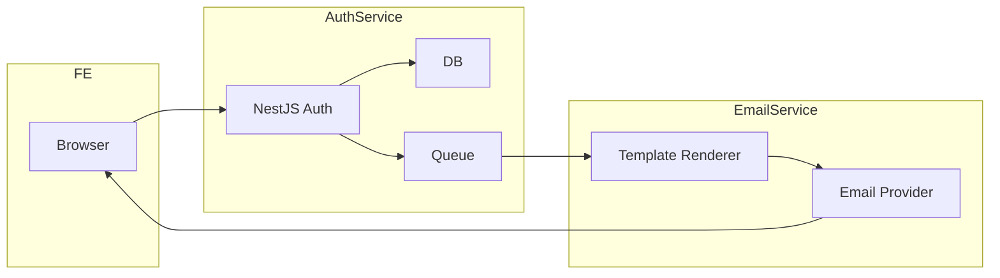

[# Tài liệu: Register & Email OTP Flow (NestJS + Zod + AWS SES/Resend + React Email)

**Mục tiêu:** mô tả chi tiết flow đăng ký tài khoản và xác thực bằng OTP gửi qua email (email OTP). Tài liệu tập trung vào **luồng (flows)**, vai trò các thành phần, tương tác giữa frontend/backend/email provider/template engine, và các kịch bản thất bại — **không đi sâu vào logic xử lý nội bộ** (ví dụ implement chi tiết của hash, encryption, queue consumer...).

---

## 1. Tổng quan nhanh

- **Actors (người tham gia):** User (client web/mobile), Frontend (React), Backend (NestJS + Zod validation), Email Template Engine (React Email), Email Provider(s) (AWS SES hoặc Resend), Database (Postgres/MySQL/SQLite), Queue (optional — RabbitMQ/SQS/Redis Streams), Rate limiter/Throttling layer, Observability (logs/metrics)
- **Fields required (khi register):** `name`, `phoneNumber`, `email`, `password`, `confirmPassword`.
- **Phạm vi tài liệu:** trình bày luồng tạo tài khoản + gửi OTP email + verify OTP. Không trình bày chi tiết authz/authn (JWT/session) — chỉ nêu điểm chạm cần thiết.

---

## 2. Mục tiêu của flow

1. Thu thập thông tin tối thiểu để tạo tài khoản.
2. Xác thực quyền sở hữu email bằng mã OTP một lần (single-use, short-lived).
3. Đảm bảo an toàn: OTP không lưu plaintext, giới hạn resend, rate-limit, audit.
4. UX mượt: feedback cho user, trạng thái rõ ràng (pending / verified / expired).

---

## 3. Thành phần và vai trò

- **Frontend (React):** form đăng ký, hiển thị trạng thái (sent, verified, expired, resend), call API.
- **Validation (Zod):** validate schema form trên server (và khuyến nghị validate client side). Giữ các ràng buộc: email format, password strength, phone format.
- **API Gateway / NestJS:** tiếp nhận request, orchestrate: tạo user tạm (status: `pending`), tạo OTP record, push email job (queue) hoặc gọi gửi trực tiếp.
- **Email Template (React Email):** render email HTML/Plain với OTP token hoặc link xác thực; templates dễ test, snapshot, và hỗ trợ dynamic content.
- **Email Provider (AWS SES / Resend):** gửi email transactional; backend gửi payload (to, subject, html, text). AWS SES thường dùng cho hệ sản xuất AWS-native; Resend là provider transactional tập trung dev-friendly.
- **Database:** lưu `User` (status), `EmailOtp` (hashed token, createdAt, expiresAt, attempts, usedAt), audit logs.
- **Queue (optional):** dùng để decouple request-response, retry, backoff, và throttle gửi email.
- **Rate limiter / Throttle:** ngăn spam resend/abuse.
- **Monitoring & Alerting:** email send failures, bounce rates, OTP verification failure spikes.

---

## 4. High-level flow (flowchart)



> Ghi chú: email có thể chứa 1) mã OTP (6-8 chữ số) hoặc 2) link có token 1 lần. Link đơn giản cho UX; mã OTP phù hợp khi cần nhập tay.

---

## 5. Luồng tương tác chi tiết (sequence diagram)



---

## 6. API surface (suggested endpoints)

> Các đường dẫn và payload dưới đây là gợi ý, không bắt buộc.

- `POST /api/auth/register`
  - Body: `{ name, email, phoneNumber, password, confirmPassword }`
  - Response: `201 Created` + `{ message: 'otp_sent', next: 'verify' }`

- `POST /api/auth/resend-email-otp`
  - Body: `{ email }`
  - Response: `200` + `{ message: 'otp_resent' }`
  - Rate-limited

- `POST /api/auth/verify-email-otp`
  - Body: `{ email, otp }` or `{ token }` for link flow
  - Response success: `200` + `{ message: 'verified' }`
  - Failure: `401 Unauthorized` (bad otp) or `410 Gone` (expired) or `429 Too Many Requests` (too many attempts)

- `GET /api/auth/registration-status?email=...`
  - Optional: để frontend poll/check status after email link clicked on mobile device.

---

## 7. Data model (minimal)

```sql
-- User (simplified)
User {
  id uuid,
  name varchar,
  email varchar unique,
  phone_number varchar,
  password_hash varchar,
  status enum('pending', 'active', 'disabled'),
  created_at,
  updated_at
}

-- EmailOtp
EmailOtp {
  id uuid,
  user_id uuid,
  token_hash varchar, -- store only hash
  type enum('email'),
  created_at timestamptz,
  expires_at timestamptz,
  used_at timestamptz nullable,
  attempts int default 0,
  channel varchar, -- e.g., 'ses' or 'resend'
}
```

---

## 8. OTP design & best practices (tập trung vào flow và an toàn)

- **Single-use & short TTL:** OTP nên có thời hạn ngắn (ví dụ 5–15 phút) và được đánh dấu `usedAt` khi xác thực thành công.
- **Store only hash:** lưu `token_hash` thay vì plaintext. Khi verify, hash input và so sánh.
- **Rate-limit & attempt limit:** giới hạn số lần thử (ví dụ 5 lần) và giới hạn gửi lại (ví dụ 3 lần trong 1 giờ) — nếu vượt, khóa tạm thời hoặc yêu cầu captcha.
- **Throttling gửi email:** dùng queue để điều tiết tỉ lệ gửi, retry/circuit-breaker khi provider trả lỗi.
- **Token entropy:** OTP ngắn cho UX (6 chữ số) — nếu cần bảo mật cao hơn, dùng longer alphanumeric token trong link.
- **Link vs Code tradeoff:** link 1-click tốt cho UX (mobile), code tốt cho privacy (khi người dùng không muốn mở link). Cân nhắc hỗ trợ cả hai.
- **Hashing algorithm:** sử dụng HMAC hoặc Argon2/sha256+salt để hash token. (Chi tiết impl là logic nội bộ — ở đây chỉ nêu khuyến nghị.)
- **Replay protection:** token chỉ hợp lệ một lần; nếu token được sử dụng, tất cả token cũ cho user nên bị invalidate.

---

## 9. Email provider & template integration (SES / Resend / React Email)

- **Template rendering:** render HTML + text bằng React Email on backend worker. Job payload: `{ userId, email, subject, templateName, templateProps }`.
- **Providers:**
  - **AWS SES:** production-grade, cần domain verification, DKIM/SPF, handling bounce/complaint topics (SNS). Thích hợp nếu infra AWS.
  - **Resend:** provider transactional API thân thiện dev, dễ mock/inspect.

- **Delivery feedback:** listen to bounce/complaint (SES SNS or Resend webhooks) để mark emails as suppressed.
- **Template preview & testing:** use snapshot tests for template components; use a staging provider/address before production.

---

## 10. UX flows & edge cases

1. **User registers but never opens email:** provide `resend` button, and optionally a `check status` poll endpoint.
2. **User clicks link on mobile but frontend session different:** handle token-based verification server-side; after token valid, return redirect to a `magic` URL (short-lived) or instruct user to login.
3. **Expired OTP:** return `410 Gone` with friendly message and a CTA to resend.
4. **Multiple concurrent OTPs:** keep only the latest as valid or track versions and only accept latest N (recommendation: accept only the latest and invalidate older ones).
5. **Email deliverability issues:** surface `email_send_failure` to user and queue for retry; recommend informing user to check spam.

---

## 11. Operational considerations

- **Monitoring metrics:** OTP requested per minute, OTP verified, OTP failed attempts, email send success/fail, bounce rate.
- **Alert thresholds:** surge of failed verifications (possible attack), high bounce rate.
- **Logs & audit:** store events (otp_created, otp_sent, otp_verified, otp_failed) with timestamps for investigation.
- **Secrets & keys:** keep SES/Resend API keys in secrets manager; rotate keys periodically.

---

## 12. Testing strategy

- **Unit tests:** Zod validation schemas, token generation/hash helpers (mock hashing), template snapshots (React Email).
- **Integration tests (local):** use a transactional email sandbox or mock provider; test register -> queue -> send -> verify.
- **E2E tests:** simulate user flows with test email inbox (MailHog, Ethereal) or provider sandbox.

---

## 13. Example UX copy & HTTP responses (concise)

- After register: `201 Created` — `{ message: "OTP_SENT", next: "verify", retry_after: 60 }`
- After verify success: `200 OK` — `{ message: "VERIFIED" }`
- OTP invalid: `401` — `{ code: "INVALID_OTP", message: "Mã OTP không đúng" }`
- OTP expired: `410` — `{ code: "OTP_EXPIRED", message: "Mã OTP đã hết hạn" }`
- Resend limit exceeded: `429` — `{ code: "TOO_MANY_REQUESTS", retry_after: 3600 }`

---

## 14. Checklist triển khai (quick)

- [ ] Zod schema cho register + verify
- [ ] DB models: User, EmailOtp, Audit
- [ ] Email templates (React Email) + snapshot tests
- [ ] Queue worker (render template -> call provider)
- [ ] SES / Resend integration + webhook handlers for bounce
- [ ] Rate limiter + attempt counters
- [ ] Monitoring + alerts
- [ ] E2E tests with sandbox inbox

---

## 15. Diagrams bổ sung (nếu cần mở rộng sang microservices)



---

## 16. Kết luận ngắn gọn

Tài liệu này cung cấp map chi tiết của luồng đăng ký + email-OTP cho hệ thống backend dùng NestJS, Zod, React Email, và nhà cung cấp email (SES/Resend). Tập trung vào tương tác giữa các thành phần, các trạng thái, và best practices bảo mật/operational. Nếu muốn, tôi có thể:

- xuất bản phiên bản tiếng Anh,
- chuyển một phần thành checklist PR/Implementation-ready,
- hoặc tạo sơ đồ sequence/flow ở dạng PNG/SVG để nhúng vào tài liệu chính thức.

---

_Hết tài liệu._
]()
